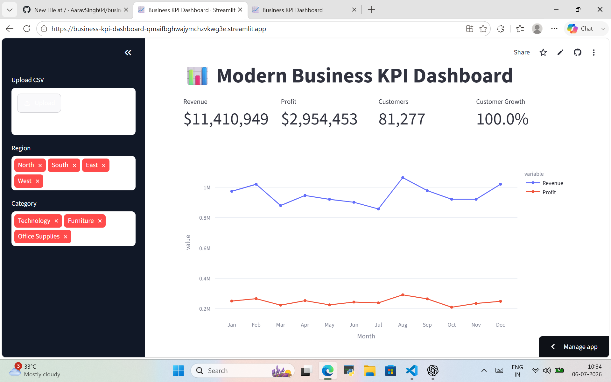

# 📊 Modern Business KPI Dashboard

A modern and interactive **Business KPI Dashboard** built using **Streamlit** and **Plotly**. This dashboard helps businesses monitor key performance indicators such as Revenue, Profit, Customer Growth, and Monthly Trends through an intuitive and responsive interface.

---

## 🚀 Live Demo

🔗 **Streamlit App:**  
https://business-kpi-dashboard-qmaifbghwajymchzvkwg3e.streamlit.app/

---

## 📸 Dashboard Preview


## ✨ Features

- 💰 Revenue KPI
- 📈 Profit KPI
- 👥 Customer Growth KPI
- 📅 Monthly Revenue & Profit Trends
- 🎯 Interactive Region & Category Filters
- 📊 Interactive Plotly Charts
- 📂 CSV Upload Support
- 📥 Download Filtered Data
- 📱 Responsive Dashboard
- 🎨 Modern and Colorful UI

---

## 🛠️ Tech Stack

- Python
- Streamlit
- Plotly
- Pandas
- NumPy

---

## 📂 Project Structure

```text
business-kpi-dashboard/
│
├── app.py
├── requirements.txt
├── README.md
└── images/
    └── dashboard.png
```

---

## ⚙️ Installation

Clone the repository

```bash
git clone https://github.com/AaravSingh04/business-kpi-dashboard.git
```

Go to the project folder

```bash
cd business-kpi-dashboard
```

Create a virtual environment (Optional)

```bash
python -m venv .venv
```

Activate it

### Windows

```bash
.venv\Scripts\activate
```

Install dependencies

```bash
pip install -r requirements.txt
```

---

## ▶️ Run the App

```bash
streamlit run app.py
```

The application will open at

```
http://localhost:8501
```

---

## 📊 Dashboard Includes

- Revenue KPI Card
- Profit KPI Card
- Customer KPI Card
- Customer Growth KPI
- Monthly Trend Analysis
- Revenue by Region
- Profit Distribution
- Revenue vs Customer Analysis
- Interactive Filters
- CSV Upload
- Data Download

---

## 📈 Future Improvements

- Dark Mode
- AI Business Insights
- Forecasting Dashboard
- Sales Prediction
- Power BI Style KPI Cards
- Authentication
- Database Integration

---

## 👨‍💻 Author

**Aarav Singh**

MBA (Product Management)  
Harishankar Singhania School of Business  
JK Lakshmipat University

GitHub: https://github.com/AaravSingh04

---

## ⭐ Support

If you found this project useful, please consider giving it a ⭐ on GitHub.